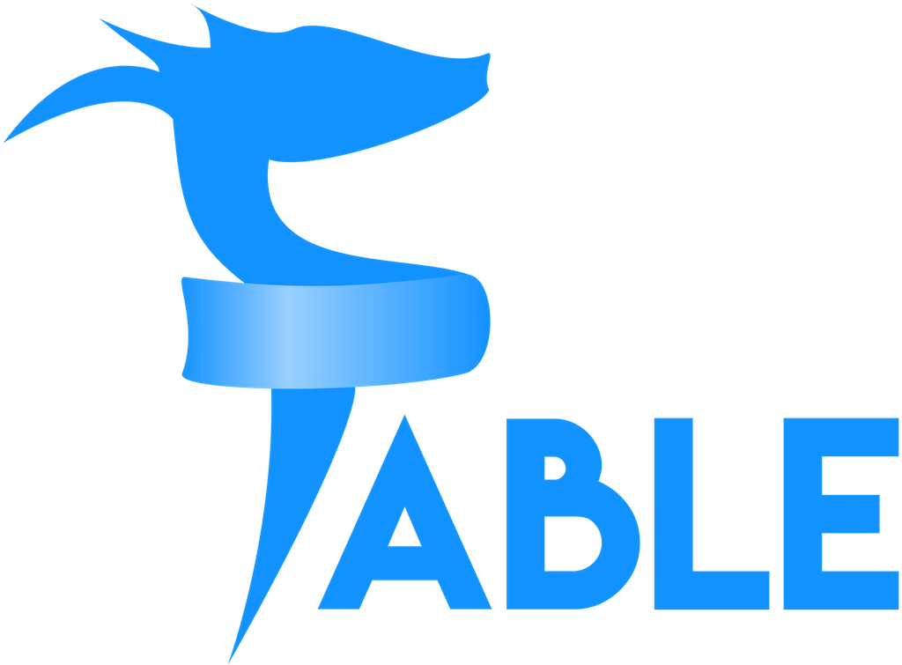
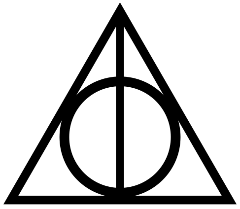

- title : Scaling Elmish App
- description : How to Scale Elmish App
- author : Kunjan Dalal
- theme : serif
- transition : none

***


## Scaling Fable Elmish / Elm Application
### An Experience Report By

<br />
### Kunjan Dalal
### @kunjee
<br />


' Hello Hello. My self Kunjan Dalal, also known as Kunjee. I will be skipping other parts of the intro; because we are having some time issues.

***


### Agenda for Today

- <s>Intro to me</s>
- <s>Intro to Elm</s>
- Intro to Fable & Fable.Elmish
- <s>Basic Example</s>
- <s>The Elm Architecture - TEA </s>
<!-- - Past - All the W question answered  -->
<!-- - Back End, Front End and more Front End -->
<!-- - The Model -->
<!-- - The View -->
<!-- - The Update -->
- Tips and Tricks for Scaling your Application
- Why Elmish instead of Elm
- <s>External JS library in Fable Elmish </s>
- <s>External React library in Fable Elmish </s>
- <s>SAFE stack</s>
- Thank You!!!


' This talk was 45 mins long when I submitted. It has been cut down to 20 minutes due to other nice talks in the same area. So, I will also be cutting down a few things you might already know from other talks at this conference.


***


### Pop Quiz Time


' How many of you know about Elm?
' How many are using Elm in a production application? A whole application or may be part of it?
' Here is an important question. How many of you feel that the nice demo application is shown in the conference never get converted to the full-blown application?

***

<s>
### Demo
</s>

' We will not see any demo today.
' Instead will talk about the past, more about what is possible in contrast to what can be possible.

---

### Why Code Samples will be  in F#?

> It is a general-purpose functional programming language. It is a very much mainstream language. It works for web and mobile. It is very much strongly type language. It is F#.

' In this slides, all code samples will be in F#.

***

### Intro to Fable & Fable Elmish

 > Fable is an F# to JavaScript compiler powered by Babel, designed to produce readable and standard code.

 <br/>

 > Elmish implements core abstractions that can be used to build Fable applications following the “model view update” style of architecture, as made famous by Elm.

' There are two different things in Fable Elmish. Fable and Fable-Elmish or Elmish generally speaking. Let's have a look at both.

***

### Fable


---

##### F# unit of Measure code

```fsharp
    module Tour.UnitsOfMeasure

    // From https://docs.microsoft.com/en-us/dotnet/fsharp/tour
    open Microsoft.FSharp.Data.UnitSystems.SI.UnitNames

    let sampleValue1 = 1600.0<meter>

    [<Measure>]
    type mile =
        static member asMeter = 1609.34<meter/mile>

    let sampleValue2 = 500.0<mile>

    let sampleValue3 = sampleValue2 * mile.asMeter

    printfn "After a %f race I would walk %f miles
            which would be %f meters" sampleValue1 sampleValue2 sampleValue3

```

' Here is a simple F# code with its specific Unit of Measure feature. A tight guard against how you define units. It is very helpful in the industry like Finance, Biology, Research etc.

---

##### Converted Java Script Code

```js
    import { toConsole, printf } from "fable-core/String";
    export const sampleValue1 = 1600;
    export function mile$$$get_asMeter() {
    return 1609.34;
    }
    export const sampleValue2 = 500;
    export const sampleValue3 = sampleValue2 * mile$$$get_asMeter();
    toConsole(
        printf("After a %f race I would walk %f miles which would be %f meters"))
            (sampleValue1)(sampleValue2)(sampleValue3);
```

' Have a look at this. A very readable JavaScript. Which then pass on to Bable to boil down to normal JavaScript which can be understood by the browser.

***

### Elmish


---

##### Elmish - Types

```fsharp
    type Model =
        { Value : string }

    type Msg =
        | ChangeValue of string
```

' Your routine model with a single property of type String. To change that we need to pass the message of value string.

---

##### Elmish - State

```fsharp
    let init () = { Value = "" }, Cmd.none

    // UPDATE

    let update (msg:Msg) (model:Model) =
        match msg with
        | ChangeValue newValue ->
            { Value = newValue }, Cmd.none
```

' Init is initializing with an empty value and then update will take care of every change happen in the application.

---

##### Elmish - View

```fsharp
    let view model dispatch =
        div [ Class "main-container" ]
            [ input [ Class "input"
                    Value model.Value
                    OnChange (fun ev -> ev.target?value |>
                                string |> ChangeValue |> dispatch) ]
            span [ ]
                [ str "Hello, "
                str model.Value
                str "!" ] ]
```

' Here is a simple view that takes the value and shows it to a user. Also, it can dispatch a message to update method.

---

##### Elmish - Main

```fsharp
    // App
    Program.mkProgram init update view
    |> Program.withConsoleTrace
    |> Program.withReact "elmish-app"
    |> Program.run
```

' And here is wire up a code. Not much different than your regular Elm code. It is following the elm architecture.

<!-- ***

### Back End - Front End - Back End - Front End - Back End


' I love back end and made a career out of it, and I strongly believe that front end is also required good architecture, Nowadays it is more required. So, today will be talking about that front end part. -->

***

### What is SPA ?



' When they told us about Single Page Application, they promise us that you don't need to any other thing other than HTML, javascript, and CSS. They promise a triangle of power, but instead what we got?

---

- data-background-image: images/triangles.gif

***
 - data-background-image: images/oldman.jpeg


'  Today I will be providing tips and tricks for your Elm / Elmish application. I wish you will take the advice as it is. Just like we used to take advise of a wise old man. Respecting time nothing else.

***

### Model - View - Update

' In MVU architecture I feel that the model is the most important thing. It is a message between update and view, and whoever controls the message controls the narrative.

---

- data-background-image: images/news.gif

' So, my tips and tricks will start from that only.

***

### Let's Talk about Model


---

### Application & Authentication

```fsharp
type Msg =
    | ApplicationMsg of Application.Types.Msg
    | AuthenticationMsg of Authentication.Types.Msg

type PageModel =
    | ApplicationModel of Application.Types.Model
    | AuthenticationModel of Authentication.Types.Model

type Model = {
    UserToken : AuthToken option
    CurrentPage : Page
    PageModel : PageModel
}

```
---

```fsharp
match page with
| AuthenticationPage a ->
    let (authentication, authenticationCmd) =
        Authentication.State.init(a)
    in
    {model with CurrentPage = AuthenticationPage a;
        PageModel = AuthenticationModel authentication},
            Cmd.map AuthenticationMsg authenticationCmd

| ApplicationPage a ->
    if model.UserToken.IsNone
    then model, Navigation.modifyUrl(toHash (AuthenticationPage Login))
    else
    let (application, applicationCmd) =
        Application.State.init(a,model.UserToken.Value)
    in
    {model with CurrentPage = ApplicationPage a;
        PageModel = ApplicationModel application},
            Cmd.map ApplicationMsg applicationCmd

```


' An Authenticated user can access the application module and all users can access the Authenticate module. If you are starting your application and you are having user authentication in your application then you surely like to do this. If you are having 2 - 3 pages where a user needs to be authenticated then it is ok but not more than that; you seriously like to save your self from repeated user verification code.
' Pro tip - Use JWT if you are still not using it. It is nice to have when you are developing a Stateless application.

---

### Page Model

```fsharp
module Types =

type BadPageModel = {
    HomeModel : Home.Types.Model
    UsersModel : Users.Types.Model
    ProfileModel : Profile.Types.Model
}

type GoodPageModel =
    | HomeModel of Home.Types.Model
    | UsersModel of Users.Types.Model
    | ProfileModel of Profile.Types.Model

```

' There are two ways of writing page-model. But having page model as option type always helps. You are only loading data that is required for a page, nothing else.
' Pro tip - You can group pages by Navigation. So, one less naming problem solve.

---

### Page - Model

```fsharp
type HomeModel = {
    Component1 : Component.Types.Model
    Component2 : Component.Types.Model
    ....
}
```

' Divide your page into multiple components. Even if your page is having a single big entry form, divide that into a logical group. It always helps to manage small chunks of code compared to a big chunk.
' Even simple entry forms are doing many things, like validation on a client-side and validation on the server side as if a username is available or not.
' Features, like autocomplete will, requires a server and client-side code.

***

### Component Model

' We almost reached halfway, so it is time for a little break.

---


---

### Domain - Driven - Design


---

### Domain Model on Client Side

```fsharp
type Validate = {
    IsValid : bool
    Message : string
}

type Person = {
    FirstName : string
    LastName : string
}

type PersonError = {
    FirstName : Validate
    LastName : Validate
}

type Model = {
    Person : Person
    PersonError : PersonError
}
```

' Most dumb domain model example to give an idea. Here just to show that first name should not be empty I need to update model, then Person-Error, then Validate and then message. It is three level deep. One can always use lenses to update them, but if you need to use lenses then you are doing something wrong. As model represent the view, we need to keep it as flat as possible. Use of lenses will become more and more complicated as an application grows. Instead, divide model in multiple models in MVU fashions.

---

### Flatten the model

```fsharp
type Validate = {
    IsValid : bool
    Message : string
}

type FirstName = {
    Value : string
    Valid : Validate
}

type LastName = {
    Value : string
    Valid : Validate
}

type Person = {
    FirstName : FirstName
    LastName : LastName
}

```
---

##### OR

```fsharp
type Person = {
    FirstName: string
    FirstNameErr : Validate
    LastName : string
    LastNameErr : Validate
}
```

***

### Let's Talk about Command

---

### Single Responsibly Principal

```fsharp
type Msg =
    | ChangeValue of string
    | Changed of string

let init () = { Value = "" }, Cmd.none

let update (msg:Msg) (model:Model) =
    match msg with
    | ChangeValue newValue ->
        let updateValue = newValue.ToUpper()
        model, Cmd.ofMsg (Changed updateValue)
    | Changed updatedValue ->
        { Value = updatedValue}, Cmd.none
```

' One command should be doing one and only one thing. Here I capitalizing everything coming into the update function. Just because why not?  But you can do validation or and post to data to a server.
' As command processes, the data, pass it to Changed message. It is confirmation that everything is good to go.

---

### Another way to Look at it

```fsharp
type Command = | ChangeValue of string
type Event = | Changed of string

type Msg =
    | Command of Command
    | Event of Event

let init () = { Value = "" }, Cmd.none

let processCommand (msg : Command) (model : Model) =
    match msg with
    | ChangeValue newValue ->
        let updateValue = newValue.ToUpper()
        model, Cmd.ofMsg (Event (Changed updateValue))

let processEvent (msg : Event) (model: Model) =
    match msg with
    | Changed value ->
        { Value = value}, Cmd.none
```

---

```fsharp

let update (msg:Msg) (model:Model) =
    match msg with
    | Command c -> processCommand c model
    | Event e -> processEvent e model
```

---


### Subscribe is there to Use

```fsharp
// Types
type Model = CurrentTime of DateTime
type Messages = Tick of DateTime

// State
let initialState() =
    CurrentTime DateTime.Now, Cmd.none

let update (Tick next) (CurrentTime _time) =
    CurrentTime next, Cmd.none

let timer initial =
    let sub dispatch =
        Browser.window.setInterval(fun _ ->
            dispatch (Tick DateTime.Now)
        , 1000) |> ignore
    Cmd.ofSub sub
```

' This is a famous subscribe example. But it is way more powerful than this. Let's have another example where it can be used.

---

### Real Time or Reactive Application

```fsharp
let subscribe =
        let socketSubscription dispatch =
            let eventSourceOptions = createEmpty<IEventSourceOptions>
            eventSourceOptions.handlers <- createObj [
                "onMessage" ==>
                    fun (msg: ServerEventMessage) ->
                        printfn "onMessage %A" msg.json
                "chat" ==>
                    fun (msg : OutputMessages) ->
                                msg |> (SSESuccessMessages >> dispatch)
            ]

            let channels = [|"home"; ""|]
            SSClient.ServerEventsClient.Create(baseUrl
            , new List<string>(channels)
            , eventSourceOptions
            ).start() |> ignore
        Cmd.ofSub socketSubscription
```

' Be it Real-time or reactive application; Subscribe is pretty useful. Here you can subscribe to events those are coming from the server. Events will update the UI eventually.

***

### Let's Talk about View

---
- data-background-image: images/catgroup.jpg

```fsharp
let root model dispatch =
    Container.container[ Container.IsFluid ][
        documentTable model dispatch
    ]
```


' A view should be Small & cute. It should be a representation of the whole page. So, if someone is reading root function, s/he will get the idea.

---

### Use CSS Wrappers like Fulma

```fsharp
form [ ]
        [ // Email field
            Field.div [ ]
                [ Label.label [ ]
                    [ str "Email" ]
                  Control.div [ Control.HasIconLeft
                                Control.HasIconRight ]
                    [ Input.email [ Input.Color IsDanger
                                    Input.DefaultValue "hello@" ]
                      Icon.faIcon [ Icon.Size IsSmall; Icon.IsLeft ]
                        [ Fa.icon Fa.I.Envelope ]
                      Icon.faIcon [ Icon.Size IsSmall; Icon.IsRight ]
                        [ Fa.icon Fa.I.Warning ] ]
                  Help.help [ Help.Color IsDanger ]
                    [ str "This email is invalid" ] ] ]
```
' It will make so much easier to write UIs with wrappers. Please use them.

***

### Why I choose Elmish?

- One Language of for Server, Client (Web & Mobile), Data Science / ML & Data Processing etc.
- Possible to leverage JavaScript libraries (Stateless one)
- Possible to leverage React libraries (Stateless one)
- Because of all these, I can leverage my experience, I acquired throughout all these years.

---

### Recharts

```fsharp
let lineChartSample =
    lineChart
        [ margin 5. 20. 5. 0.
          Chart.Width 600.
          Chart.Height 300.
          Chart.Data data ]
        [ line
            [ Cartesian.Type Monotone
              Cartesian.DataKey "uv"
              P.Stroke "#8884d8"
              P.StrokeWidth 2. ]
            []
          cartesianGrid
            [ P.Stroke "#ccc"
              P.StrokeDasharray "5 5" ]
            []
          xaxis [Cartesian.DataKey "name"] []
          yaxis [] []
          tooltip [] []
        ]
```
' Here is Rechart example in F#. No need to create graph library from bottom up. BTW even ReChart is using D3 to draw charts.


***
- data-background-image: images/catthankyou.gif

---

- Awesome Fable - [https://github.com/kunjee17/awesome-fable](https://github.com/kunjee17/awesome-fable)
- Safe Stack - [https://safe-stack.github.io/](https://safe-stack.github.io/)
- WTF# Elmish - [https://wtfsharp.net/wtf-is-elmish](https://wtfsharp.net/wtf-is-elmish)
- Fulma - [https://mangelmaxime.github.io/Fulma/](https://mangelmaxime.github.io/Fulma/)
- Fable - [https://fable.io/](https://fable.io/)

' Here is an awesome fable link where I am maintaining all awesome stuff happening in Fable world.
' Safe-Stack is just like MEAN-Stack but everything in F#. Even if you are not interested in F# then also do check it out. It is featured in Thought works Tech Radar recently.
' And I personally feel that every Functional Programming language should have similar kind of stack.
' Then there is What the F# podcast, Where I and Alfonso Garcia Caro was talking about Elmish.
' There is also a link for fulma
' And the obvious fable link. Do try out Fable REPL, it is compiling whole F# code in the browser itself. So, your code will totally work in offline mode.

---

- Fuzzy Cloud - [https://fuzzycloud.in/](https://fuzzycloud.in/)
- Fable Compiler @ Twitter - [@FableCompiler](https://twitter.com/FableCompiler)
- Me (Kunjan Dalal) @ Twitter - [@kunjee](https://twitter.com/kunjee)


' Fuzzy Cloud is consulting things I started recently. I am available for training and consulting for everything related but not limited to Functional Programming.
' I am carrying my visiting card with me if anyone likes to have.
' If you have enjoyed this talk please tag Fable Compiler and me (I am totally optional) with your good comments.
' Please provide your criticism and inputs to me, I will surely try to improve for next talk.
' Any questions? Else I am available here only for today at least. Do stay in touch.
